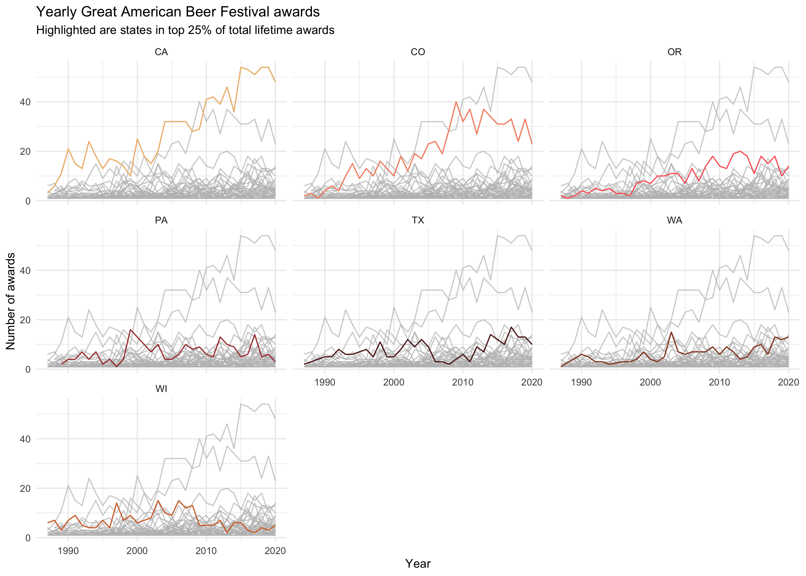

# Beer Awards

This week we explore beer!
More specifically, the data for this week contains information on awards from
 the [Great American Beer Festival](https://www.greatamericanbeerfestival.com/).
The data set and background information can be found on the Tidy Tuesday
 GitHub [here](https://github.com/rfordatascience/tidytuesday/tree/master/data/2020/2020-10-20).

I was pretty excited when I saw this weeks data.
I've known about Tidy Tuesday for a while now but just never got around to
 participating.
When I was what this week was about, it was the final push I needed to join in
 on the fun.
 
My submission this week is a plot of awards received over time.
Plotting all 50 states would be a bit overwhelming though.
So I only included states that were in the top 25% of total lifetime awards
 received.
Each of the sub-plots includes lines for all 50 states for comparison, but only
 the top states are included in sub-plots.
The highlighted lines indicate the 'current' state in each sub-plot.
This makes each state stand out and allows for comparison with the other 50
 states.
 
What really stands out in this plot is that California and Colorado have
 consistently *dominated* the other states and the gap has grown over time.
But Colorado has seen a dip in the past five years so their lead may be
 dwindling.
Most of the other states have been chugging along winning a relatively 
 consistent number of awards each year.
 

